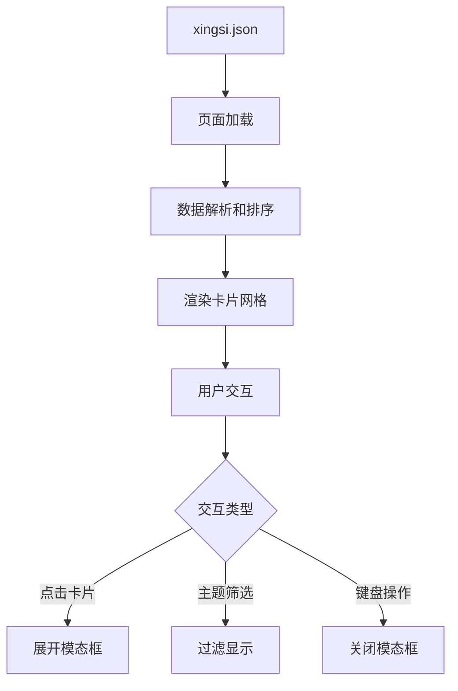

# 行思录卡片展示模块技术文档

## 📋 概述

行思录卡片展示模块是一个专为个人思考记录设计的展示系统，将结构化的日常思考、觉察与洞察以优雅的卡片形式呈现，支持详情展开、主题筛选和响应式布局。

### 核心特性
- 🎨 **紧凑卡片设计** - 高信息密度的卡片布局
- 📱 **响应式网格** - 自适应1-4列显示
- 🔍 **模态框详情** - 点击展开完整内容
- 🏷️ **主题筛选** - 按探索主题分类显示
- 📊 **统计面板** - 记录概况和数据洞察
- 🌙 **主题适配** - 完美支持深色/浅色模式

## 🏗️ 架构设计

### 文件结构
```
src/
├── components/
│   └── XingsiCard.astro          # 卡片组件
├── pages/
│   └── xingsi.astro              # 主页面
├── types/
│   └── xingsi.ts                 # 类型定义
└── data/
    └── xingsi.json               # 数据源
```

### 数据流


## 📊 数据结构

### 核心数据类型

```typescript
// src/types/xingsi.ts
export interface XingsiRecord {
  datetime: string;                    // ISO格式日期时间
  flomo_link: string;                  // 原文链接
  今日小计: string;                    // 日常记录内容
  主题行动复盘: {
    title: string;                     // 复盘标题
    details: {
      本周主题: string;                // 探索主题
      今日实验?: string;               // 实验内容
      行动与观察?: string;             // 观察记录
    };
  };
  察觉与洞察: {
    感受: string;                      // 情感状态
    洞察: string;                      // 核心洞察
  };
  明日计划: string;                    // 未来规划
  image_url?: string;                  // 配图链接
}
```

### 数据示例

```json
{
  "datetime": "2025-06-30 22:21:35",
  "flomo_link": "flomo://./mine/?memo_id=MTgzNjMwMjcz",
  "今日小计": "昨晚因为吃了自助，肚子饱胀...",
  "主题行动复盘": {
    "title": "一次在"精力赤字"下的艰难实验",
    "details": {
      "本周主题": "精力节律优化",
      "今日实验": "（回顾式）在睡眠严重不足...",
      "行动与观察": "实验开始于一个负面状态..."
    }
  },
  "察觉与洞察": {
    "感受": "疲惫、失望，感觉"什么都没干成"。",
    "洞察": "我发现我的 "成就感" 和我的实际"成果"..."
  },
  "明日计划": "在明晚的"察觉与洞察"部分...",
  "image_url": "https://static.flomoapp.com/..."
}
```

## 🎨 界面设计

### 页面布局

#### 1. 页面头部
```astro
<!-- 统计信息面板 -->
<div class="stats-grid">
  <div class="stat-item">
    <span class="stat-value">总记录数</span>
    <span class="stat-label">total</span>
  </div>
  <!-- 更多统计项 -->
</div>
```

#### 2. 主题筛选
```astro
<!-- 主题标签列表 -->
<div class="themes-list">
  {themes.map(theme => (
    <button class="theme-tag" data-theme={theme}>
      {theme}
    </button>
  ))}
</div>
```

#### 3. 卡片网格
```astro
<!-- 响应式网格布局 -->
<div class="records-grid">
  {records.map(record => (
    <XingsiCard record={record} />
  ))}
</div>
```

### 卡片组件设计

#### 卡片结构
```astro
<article class="xingsi-card">
  <!-- 头部：日期时间 + 心情图标 -->
  <header class="card-header">
    <div class="date-section">
      <time class="date-text">6月30日</time>
      <span class="time-text">22:21</span>
    </div>
    <span class="mood-icon">😴</span>
  </header>

  <!-- 主题标签 -->
  <div class="theme-row">
    <span class="theme-tag">精力节律优化</span>
  </div>

  <!-- 内容预览 -->
  <div class="content-preview">
    <p class="summary-text">今日小计摘要...</p>
    <div class="insight-preview">
      <span class="insight-label">💡</span>
      <span class="insight-text">核心洞察...</span>
    </div>
  </div>

  <!-- 展开按钮 -->
  <button class="expand-button">
    <span>查看详情</span>
    <span class="expand-icon">▼</span>
  </button>
</article>
```

#### 模态框结构
```astro
<div class="detail-modal hidden">
  <div class="modal-overlay"></div>
  <div class="modal-content">
    <header class="modal-header">
      <h2>行思录详情</h2>
      <button class="close-btn">✕</button>
    </header>
    
    <div class="modal-body">
      <!-- 完整内容展示 -->
      <section class="detail-section">
        <h3>📝 今日小计</h3>
        <div class="text-content">...</div>
      </section>
      <!-- 更多内容区块 -->
    </div>
    
    <footer class="modal-footer">
      <a href="..." class="flomo-link">📱 查看原文</a>
      <button class="close-btn-secondary">关闭</button>
    </footer>
  </div>
</div>
```

## 🎯 核心功能

### 1. 智能摘要提取

```javascript
// 提取今日小计的摘要（前80字符）
const getSummary = (text: string) => {
  const cleanText = text.replace(/\*\*/g, '').replace(/\n+/g, ' ').trim();
  return cleanText.length > 80 ? cleanText.substring(0, 80) + '...' : cleanText;
};
```

### 2. 情绪图标映射

```javascript
// 根据感受文本返回对应图标
const getMoodIcon = (feeling: string) => {
  if (feeling.includes('平静') || feeling.includes('自在')) return '😌';
  if (feeling.includes('疲惫') || feeling.includes('累')) return '😴';
  if (feeling.includes('失望') || feeling.includes('沮丧')) return '😞';
  if (feeling.includes('焦虑') || feeling.includes('烦躁')) return '😰';
  if (feeling.includes('满足') || feeling.includes('开心')) return '😊';
  if (feeling.includes('困惑') || feeling.includes('迷茫')) return '🤔';
  return '🙂';
};
```

### 3. 模态框交互

```javascript
// 切换详情显示
window.toggleDetail = function(cardId: string) {
  const modal = document.getElementById(`detail-${cardId}`);
  if (modal) {
    modal.classList.toggle('hidden');
    
    // 防止背景滚动
    if (!modal.classList.contains('hidden')) {
      document.body.style.overflow = 'hidden';
    } else {
      document.body.style.overflow = '';
    }
  }
};

// ESC键关闭模态框
document.addEventListener('keydown', (e) => {
  if (e.key === 'Escape') {
    const openModals = document.querySelectorAll('.detail-modal:not(.hidden)');
    openModals.forEach(modal => modal.classList.add('hidden'));
    document.body.style.overflow = '';
  }
});
```

### 4. 主题筛选功能

```javascript
// 主题筛选逻辑
themeButtons.forEach(button => {
  button.addEventListener('click', () => {
    const selectedTheme = button.getAttribute('data-theme');
    
    // 更新活跃状态
    themeButtons.forEach(btn => btn.classList.remove('active'));
    button.classList.add('active');

    // 筛选记录卡片
    recordCards.forEach(card => {
      const cardTheme = card.querySelector('.theme-tag')?.textContent?.trim();
      
      if (selectedTheme === 'all' || cardTheme === selectedTheme) {
        card.style.display = 'block';
      } else {
        card.style.display = 'none';
      }
    });
  });
});
```

## 🎨 样式系统

### CSS变量和主题支持

```css
/* 使用主题变量实现深色/浅色模式 */
.xingsi-card {
  background: rgb(var(--color-fill));
  border: 1px solid rgb(var(--color-border));
  color: rgb(var(--color-text-base));
}

/* 主题色调映射 */
.theme-tag {
  background: rgb(var(--color-accent) / 0.1);
  color: rgb(var(--color-accent));
}
```

### 响应式网格布局

```css
/* 渐进式响应式设计 */
.records-grid {
  display: grid;
  gap: 1rem;
  grid-template-columns: 1fr;  /* 小屏幕：1列 */
}

@media (min-width: 640px) {
  .records-grid {
    grid-template-columns: repeat(2, 1fr);  /* 中屏幕：2列 */
  }
}

@media (min-width: 1024px) {
  .records-grid {
    grid-template-columns: repeat(3, 1fr);  /* 大屏幕：3列 */
  }
}

@media (min-width: 1280px) {
  .records-grid {
    grid-template-columns: repeat(4, 1fr);  /* 超大屏幕：4列 */
  }
}
```

### 卡片动画效果

```css
/* 悬停动画 */
.xingsi-card {
  transition: all 0.3s ease;
  cursor: pointer;
}

.xingsi-card:hover {
  box-shadow: 0 10px 15px -3px rgb(0 0 0 / 0.1);
  transform: translateY(-0.25rem) scale(1.02);
}

/* 展开按钮动画 */
.expand-icon {
  transition: transform 0.2s ease;
}

.expand-button:hover .expand-icon {
  transform: rotate(180deg);
}
```

## 📊 统计功能

### 数据统计计算

```typescript
// 统计信息生成
const stats = {
  total: totalRecords,
  thisMonth: sortedRecords.filter(record => {
    const recordDate = new Date(record.datetime);
    const now = new Date();
    return recordDate.getMonth() === now.getMonth() && 
           recordDate.getFullYear() === now.getFullYear();
  }).length,
  themes: [...new Set(sortedRecords.map(r => r.主题行动复盘.details.本周主题).filter(Boolean))],
  averageLength: Math.round(
    sortedRecords.reduce((sum, record) => sum + record.今日小计.length, 0) / totalRecords
  )
};
```

### 统计展示组件

```astro
<div class="stats-grid">
  <div class="stat-item">
    <span class="stat-value">{stats.total}</span>
    <span class="stat-label">总记录</span>
  </div>
  <div class="stat-item">
    <span class="stat-value">{stats.thisMonth}</span>
    <span class="stat-label">本月记录</span>
  </div>
  <div class="stat-item">
    <span class="stat-value">{stats.themes.length}</span>
    <span class="stat-label">探索主题</span>
  </div>
  <div class="stat-item">
    <span class="stat-value">{Math.round(stats.averageLength / 100) / 10}k</span>
    <span class="stat-label">平均字数</span>
  </div>
</div>
```

## 🔧 技术实现

### 数据处理流程

1. **数据加载**：从JSON文件导入原始数据
2. **数据排序**：按日期时间降序排列
3. **分页处理**：支持大量记录的分页显示
4. **统计计算**：实时计算各项统计指标
5. **主题提取**：自动提取所有探索主题

### 性能优化

```javascript
// 懒加载图片
if ('IntersectionObserver' in window) {
  const imageObserver = new IntersectionObserver((entries, observer) => {
    entries.forEach(entry => {
      if (entry.isIntersecting) {
        const img = entry.target as HTMLImageElement;
        img.src = img.dataset.src || img.src;
        img.classList.remove('lazy');
        observer.unobserve(img);
      }
    });
  });

  document.querySelectorAll('img[data-src]').forEach(img => {
    imageObserver.observe(img);
  });
}
```

### 唯一ID生成

```javascript
// 为每个卡片生成唯一ID
const cardId = `card-${record.datetime.replace(/[^0-9]/g, '')}`;
```

## 🚀 使用指南

### 添加新记录

1. 在 `src/data/xingsi.json` 中添加新的记录对象
2. 确保数据格式符合 `XingsiRecord` 接口规范
3. 系统会自动处理排序和显示

### 自定义主题样式

1. 修改 `getThemeColor` 函数添加新主题
2. 在CSS中定义对应的颜色变量
3. 更新主题标签样式

### 扩展功能

- **搜索功能**：在页面中添加搜索输入框
- **导出功能**：添加PDF或图片导出
- **数据可视化**：集成图表库展示趋势
- **评论系统**：为每条记录添加评论功能

## 🐛 常见问题

### Q1: 卡片不显示内容？
**A**: 检查JSON数据格式是否正确，确保所有必需字段都存在。

### Q2: 模态框无法关闭？
**A**: 确保JavaScript正确加载，检查控制台是否有错误信息。

### Q3: 主题筛选不工作？
**A**: 检查主题标签的文本内容是否与数据中的主题名称完全匹配。

### Q4: 样式在深色模式下显示异常？
**A**: 确保使用了正确的CSS变量引用格式：`rgb(var(--color-name))`。

## 📈 未来规划

### 短期改进（1-2个月）
- [ ] 添加搜索和过滤功能
- [ ] 优化移动端交互体验
- [ ] 增加数据导出功能
- [ ] 支持批量操作

### 长期愿景（3-6个月）
- [ ] 集成数据可视化图表
- [ ] 添加情感分析功能
- [ ] 支持多用户和权限管理
- [ ] 开发API接口
- [ ] 移动端PWA应用

## 📝 更新日志

### v1.0.0 (2025-01-02)
- ✅ 完成基础卡片展示功能
- ✅ 实现模态框详情展示
- ✅ 添加主题筛选功能
- ✅ 支持响应式布局
- ✅ 修复Tailwind CSS兼容性问题

---

*本文档随项目更新持续维护，最后更新：2025年1月2日*